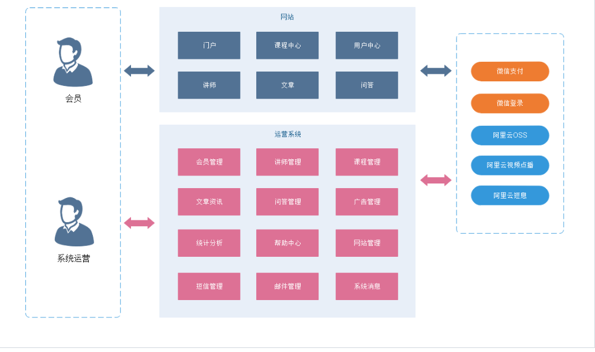
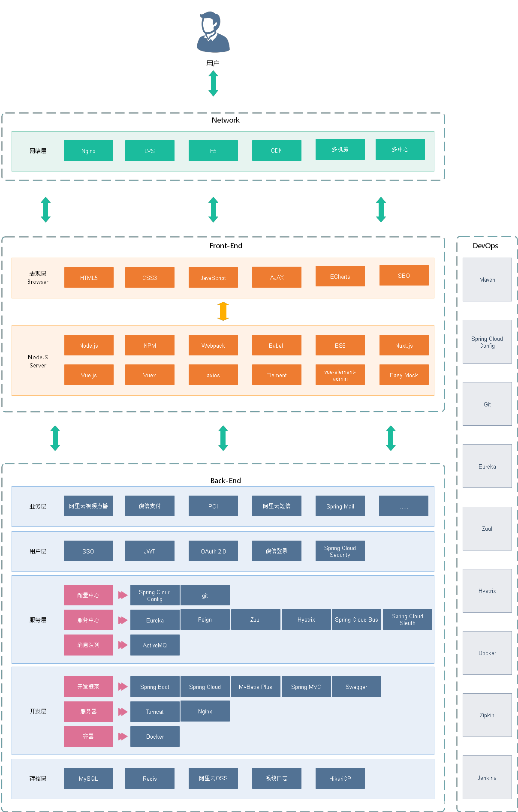
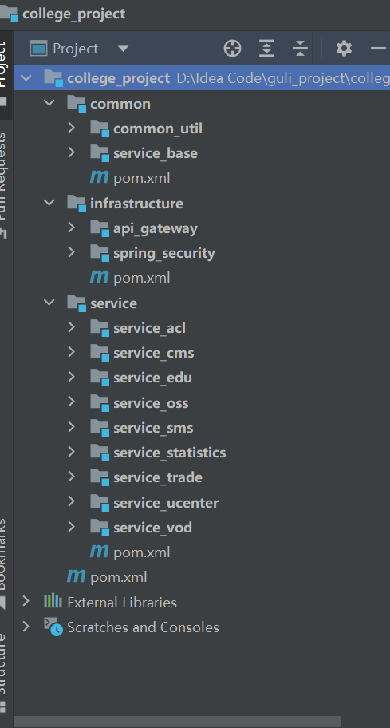

项目简介

一、功能简介
学乐云在线教育，是一个B2C模式的职业技能在线教育系统，分为前台用户系统和后台运营平台。

二、系统模块

三、系统架构
架构设计需要考虑的几个方面：

性能：主要考虑访问频率，每个用户每天的访问次数。项目初始阶段用户的访问量并不大，如果考虑做运营推广，可能会迎来服务器访问量骤增，因此要考虑分布式部署，引入缓存
可扩展性：系统功能会随着用户量的增加以及多变的互联网用户需求不断地扩展，因此考虑到系统的可扩展性的要求需要使用微服务架构，引入消息中间件
高可用：系统一旦宕机，将会带来不可挽回的损失，因此必须做负载均衡，甚至是异地多活这类复杂的方案。如果数据丢失，修复将会非常麻烦，只能靠人工逐条修复，这个很难接受，因此需要考虑存储高可靠。我们需要考虑多种异常情况：机器故障、机房故障，针对机器故障，我们需要设计 MySQL 同机房主备方案；针对机房故障，我们需要设计 MySQL 跨机房同步方案。
安全性：系统的信息有一定的隐私性，例如用户的个人身份信息，不包含强隐私（例如玉照、情感）的信息，因此使用账号密码管理、数据库访问权限控制即可。
成本：视频类网站的主要成本在于服务器成本、流量成本、存储成本、流媒体研发成本，中小型公司可以考虑使用云服务器和云服务。

四、项目结构

# 五、环境部署
准备工作
IDEA，Visual Studio Code，JDK >= 1.8 (推荐1.8版本)， Mysql >= 5.7， Maven

运行系统
1、前往GitHub下载页面(https://github.com/dlwlrma404/college_project)下载解压到工作目录。 建议使用Git克隆，因为克隆的方式可以和作者随时保持更新同步。使用Git命令克隆 git clone https://github.com/wenMN1994/GrainOnlineEducation_Parent.git

2、导入到IDEA，IDEA会自动加载Maven 依赖包，初次加载会比较慢（根据自身网络情况而定）

3、创建数据库grain并导入数据脚本resources/grain.sql

4、修改各个模块的application.yml文件的MySQL配置信息
